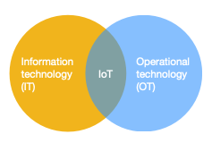

## 1. Introduction

### 1.2 What is IoT?

**IoT = Sensors + Networks + Data + Services**

IoT can be considered as contemporary Internet services to enclose different objects that are embedded with sensors, actuators, and microcontrollers.

**IT** -> consists of the secure connectivity of servers, databases, and applications.

**OT** -> is concerned with industrial work and combines things like sensors and connected devices.

It allows all things to communicate with each other; with cloud computing, IoT represents a pillar of ubiquitous computing.

---

#### Smart Objects

Smart Objects represent the building blocks of an IoT system and must have the ability to:

- sense
- compute
- communicating

**Components**:

- **Sensors**: embedded in the device allow the object to
    - sense
    - measure changes in the environment
    - convert the physical quantity into a digital representation

- **Processing Unit**: varies according to the needs and kind of processing required by the applications
    - Gathers, processes and analyzes the data acquired from the sensors.
    - The computations may call for control signals that prompt the actuator as needed.
    - Controls communication and power systems.

- **Memory**:
    - Stores key information
    - Allows the computation and communication
    - Can store data

- **Actuators**:
    Data collected by the sensors is stored and processed and can in turn trigger the actuators.

- **Communication Unit**:
    - Allows the smart objects to communicate with other devices for sharing information/data
    - Communication may take place between two or more smart objects or with the outside world through the network
    - Wireless connectivity is often preferred

- **Power Source**:
    - May be batteries, solar power, wind power, or mains supply.
    - The power consumption requirements vary greatly across scenarios

### 1.4 Facts, features and challenges

#### MGC Architecture

Despite all the differences, all IoT systems have a similar architecture.
