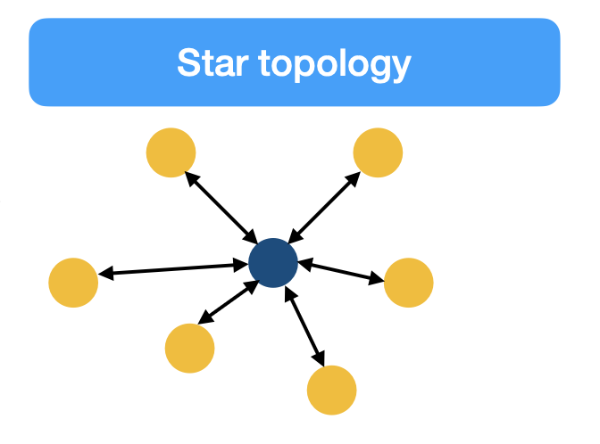
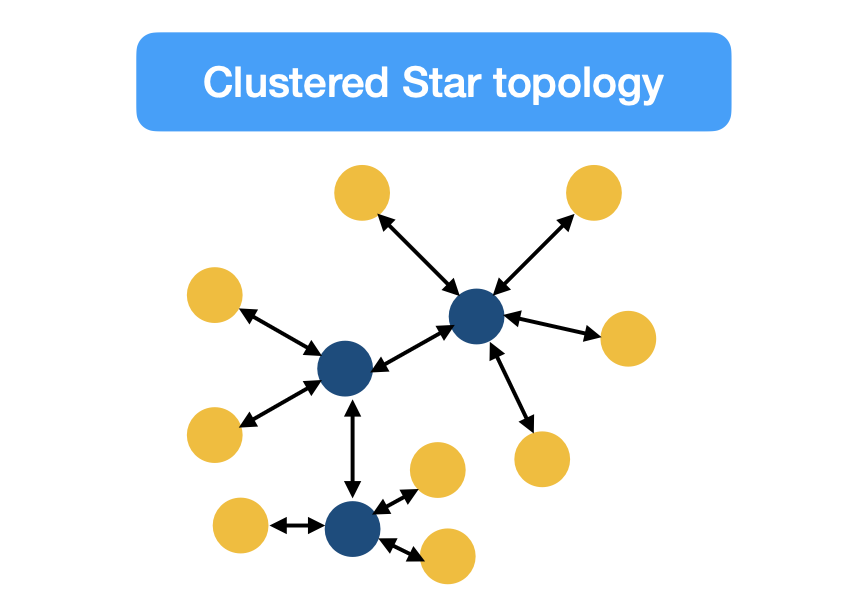
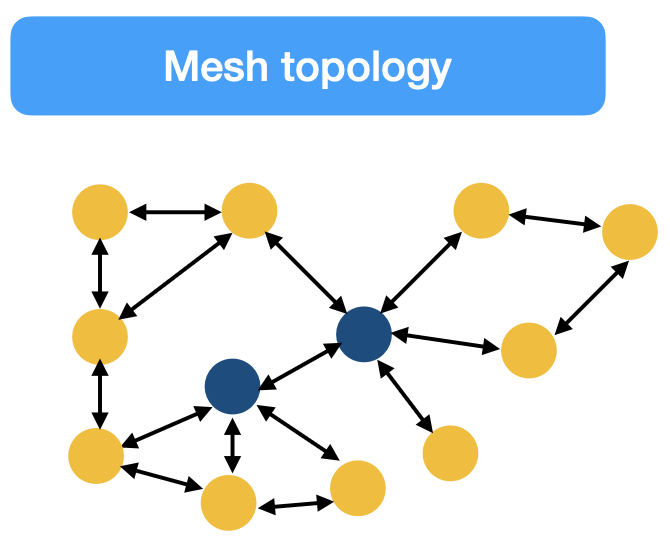
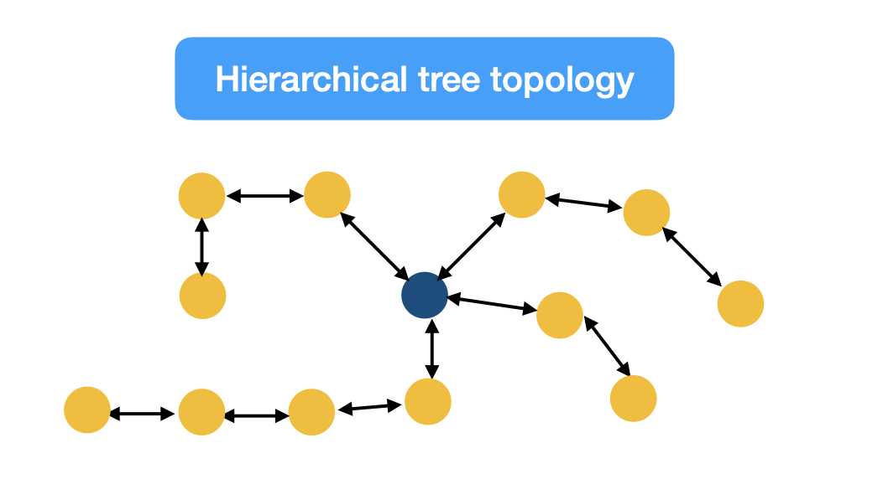

## 2. IoT Architectures

### 2.1 Drivers of IoT Architectures

#### IT and IoT

**DATA** -> IT systems are mostly concerned with reliable and continuous support for business applications.

**SMART DEVICES** -> A IoT system is also composed by ordinary objects that are made "smart" and produce a lot of data.

#### Constrained devices and networks
- Most IoT sensors are designed for a single job, and they are typically small and inexpensive.
- Large Scale of the devices + large, uncontrolled environments = lossy network supporting low data rates

---

#### Data
- In IoT, data enables business to deliver new IoT services that enhance the user experience and reduce costs.
- Most data are unstructured.
- Data analytics capabilities need to be distributed throughout the IoT network, from the edge to the cloud.

### 2.2 IoT Architecture layers

| **Core IoT Functional Stack** | **IoT Data Management and Compute Stack** |
|-------------------------------|-------------------------------------------|
| **Applications**              | **Cloud**                                | 
| **Communications Network**    | **Fog**                                  |
| **Things: Sensors and Actuators** | **Edge**                             |

---

#### Sensor layer
Consists of **heterogeneous** sensors and actuators, that sense the environment, collect information for processing to gain useful insights. (Digitalizes, creates a channel, and transfers data to the next layer).

| **Classification** | **Description** | **Examples** |
|---------------------|-----------------|--------------|
| **(1) Power source** | Devices can be **battery-powered** (autonomous, mobile but limited lifetime) or **line-powered** (continuous energy, less mobility). | - Outdoor humidity sensor (battery-powered)   - Smart motion camera (line-powered) |
| **(2) Mobility** | Devices can be **mobile** (placed on moving objects) or **static** (always at the same location). | - Smart thermometer (static)   - Self-driving car (mobile) |
| **(3) Reporting frequency** | Devices may have **low reporting frequency** (occasional reports) or **high frequency** (very frequent reports, higher energy consumption). | - Color sensor: once per day   - Motion sensor: hundreds of times per second |
| **(4) Data richness** | Devices can generate **simple data** (few values) or **rich data** (many complex parameters, higher energy consumption). | - Humidity sensor in a field: one daily value   - Engine sensor: temperature, pressure, velocity, carbon index, etc. |
| **(5) Range** | - **Sensing range**: the area around the sensor where it can take measurements   - **Transmission range**: the distance over which the sensor’s signal can be received. | - Used to classify IoT/WSN networks based on transmission range |

---

#### Network layer
In IoT systems, devices communicate with one another to cooperate and rely on machine-to-machine (**M2M**) communication protocols.

| **Network Type** | **Scale / Coverage** | **Description** | **Examples / Technologies** |
|------------------|-----------------------|-----------------|-----------------------------|
| **PAN (Personal Area Network)** | Few meters | Very small coverage, typically the personal space around a person. | Bluetooth |
| **HAN (Home Area Network)** | Few tens of meters | Network inside a home, connecting smart devices and appliances. | ZigBee, BLE |
| **NAN (Neighborhood Area Network)** | Few hundreds of meters | Connects a group of households; data is collected from multiple homes. | Smart metering |
| **FAN (Field Area Network)** | Tens to hundreds of meters | Outdoor area larger than a group of homes, often industrial or utility-related. | Smart grids, utility networks |
| **LAN (Local Area Network)** | Local site coverage | Traditional networking used also in IoT when standard technologies are adopted. | Ethernet, Wi-Fi |
| **LPWAN (Low-Power Wide-Area Network)** | Long range, low bit rate | Designed for long-distance communication with low data rate and low energy consumption. | LoRa, Sigfox |
| **Cellular Networks** | Wide area (national/global) | Distributed network over land areas divided into “cells,” each served by a base station. | 3G, 4G LTE, 5G |

##### Topologies
We have different topologies that define the connections between smart devices.

 

The choice of what topology (and protocol) to use highly depends on the application of the IoT system.

##### Gateways
Data collected from a smart object may need to be forwarded to a central station where data is processed. The station is often far from the smart object, and requires an Internet connection. 

| **IoT Gateways** | **Routers** |
|------------------|-------------|
| Support wide protocol variety (protocol translation, remote monitoring and control) | Limited protocol support |
| Low power consumption, edge computing (local processing capabilities) | Not optimised for low power |
| Handle large amounts of data (filtering, processing, collection, aggregation, security management) | Packet forwarding |
| Packet forwarding (connectivity management) | |

---

#### Application and analytics layer

The **application and analytics layer** provides the requested services to IoT users. It interprets data using software applications. Applications may monitor, control, and provide reports based on the analysis of the data.

- **Analytics application**:  
  Collects and processes data from multiple smart objects, then displays results (e.g., reports, statistics, trends, system states).  
  → Goal: provide a comprehensive view of the IoT system.

- **Control application**:  
  Controls the behavior of smart objects using complex logic not possible at device level.  
  → Example: a pressure sensor linked to a pump; if pressure drops, the control app increases pump speed.

- **Data analytics**:  
  Processes and combines sensor data to extract insights, detect events, or predict outcomes.  
  → Example: combining temperature, pressure, humidity, wind to forecast storms.

- **Network analytics**:  
  Monitors connectivity and performance of the IoT system.  
  → Example: detecting connectivity loss in autonomous vehicles or factories, which may cause critical failures.

### 2.3 Edge, Fog and Cloud Computing

- **Remote Computing** (Fog/Cloud) offer more flexibility and scalability than hosting on a local server.

- **Edge Computing** is a distributed architecture in which client data is processed at the *periphery of the network*, as geographically close to the source of data as possible. Data doesn't travel through the internet, but is transmitted from the sensors using IoT protocols.

- **Cloud Computing** is the delivery of on-demand computing resources - servers, data storage, networking capabilities, application development tools - over the internet *pay-per-use pricing*.

- **Fog Computing** lies in between edge and cloud computing. Depending on the IoT application, fog computing can provide more power resources and storage capacity than edge devices with lower costs than cloud resources. Server usually in a LAN.

### 2.4 Example of optimisation for task offloading on the fog

- **Context**:  
  Each patient wears a sensor producing data every second.  
  These data streams must be analyzed to detect falls in real time.

- **Architecture**:  
  - Sensors continuously send data to a **dispatcher**.  
  - The dispatcher decides whether to process data locally or offload tasks to **fog nodes**.  
  - Fog nodes have **limited computational resources (FLOPs)** and using them has a **cost**.

- **Objective**:  
  Minimize the **total computation cost** while ensuring all sensor data are processed.

- **Formulation**:  
  - Introduces decision variables:  
    - *yj = 1* if fog node *fj* is used, *0* otherwise.  
    - *xi,j = 1* if the task of sensor *si* is offloaded on fog node *fj*, *0* otherwise.  
  - Constraints:  
    - Each sensor’s data must be processed by exactly one fog node.  
    - The total load assigned to a fog node cannot exceed its capacity.  
  - Optimization goal:  
    - Minimize the sum of costs of the fog nodes used.  

- **Challenges**:  
  - Problem is equivalent to a **bin-packing problem (NP-complete)**.  
  - Additional real-world factors: latency, dynamic conditions, queues, and variability in resources.  

- **Solution approaches**:  
  - Approximation algorithms  
  - Heuristics  
  - Exact optimization methods (exponential time in the worst case) 