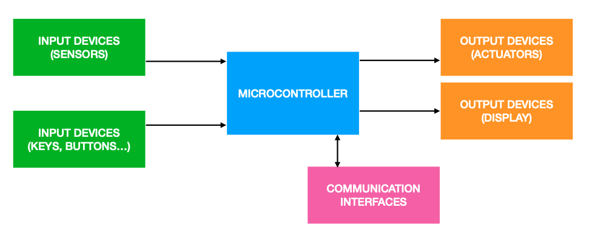
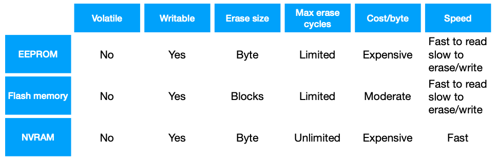

## 3. Devices

### 3.1 Sensors and Actuators

- **Sensors**: detect changes in the ambient condition or in the state of another device or a system, and forward this information. 
    - *Convert physical signals into electrical signals*

    In IoT systems, sensors are used for measuring certain quantities in an environments. The easurement will correspond to a certain action. For an ideal sensor, we expect to have a simple relationship between out input and out output.

    
    **Vendors provide specs that describe how the device behaves.**

    - Manufacturers usually tell the span or the operating range of their devices, like for what values of the measurand you. get a certain sensitivity.

    - **Mechanical sensors**: Sensors need time to collect data and to respond to the signal, we can model this dynamics with second order mechanical system. The bandwidth of a sensor, also referred to *"frequency response"*, is a measure of the ability of the sensor to perceive and respond to changes in the measurand.


- **Actuators**: are components of a device able to move the mechanism implemented in the device. Is the mechanism by which a **control system** acts upon an environment, responding to the conditions measured by a sensor. 
Motion can be:
    - *Linear*: the actuator generates movement along a straight line.
    - *Rotary*: the actuator generates a circular motion.

### 3.2 Embedded systems

Are computerised systems that are purpose-built for their applications. IoT devices are embedded systems with the additional feature that they can talk through the internet.



- **Microcontrollers** (MCU) are the brain of an embedded system and responsible for orchestrating all the operations.

- **Microprocessors** are mainly general-purpose systems, whereas microcontrollers are designed to perform very few tasks. 
    - Typical contains a CPU, interrupts, timer/counter, memory and other.

    - *Memory*: In addition to classical external memories (RAM or ROM), there also:
        - **EEPROM** (Electrically Erasable Programmable Read-Only Memory)

        - **NVRAM** (non-volatile RAM)



- **Costs and energy**: when building an embedded system. for IoT, the two main costs to keep in mind are *energy* and *money*, which have strong implications in the embedded system design. Many embedded systems are battery-powered and so you want to minimise the amount of energy consumed.

- **System Model**: Wireless transmitter equipped with an Energy Harvesting (EH) device and a rechargeable battery with limited storage capacity.


### 3.3 Markov Chains and Markov Decision

A *Discrete time stochastic process* is a sequence of random variables $X_0, X_1$ that evolve over discrete time steps. $X_n$ represents the state of a system at time n


**Definition 1.1**. A *Discrete Time Markov Chain or Process* is a sequence of random variable $X_0, X_1$, such that $X_n \in S \;\forall n$, where S is a numerable or finite set of states, and:

$$
\mathbb{P}[X_{n+1} = S_j \mid X_n = S_{i_n}, X_{n-1} = S_{i_{n-1}}, \ldots, X_0 = S_{i_0}]
= \mathbb{P}[X_{n+1} = S_j \mid X_n = S_{i_n}], \quad \forall n, m.
$$

**Definition 1.2**. A D.T.M.C. is *homogeoneous or has stationary transition probabilities* if the probability of transitioning from state s to state s' dous not change over time.

$$
\mathbb{P}[X_{n+1} = s' | X_n = s] = \mathbb{P}[X_{n+m+1} = s' | X_{n+m} = s]
$$

**Definition 1.3 — Transition Matrix**

The **transition matrix** \(P\) of a H.D.T.M.C. is a \(|S| \times |S|\) matrix with elements:

```math
p_{i,j} = P[X_n = j \mid X_{n-1} = i]
```

with the condition:

```math
\sum_{j=1}^{|S|} p_{i,j} = 1, \quad \forall i
```

**Theorem 1.1**

```math
P[X_{n+1} = s \mid X_0 = s_0] = p^{(n+1)}_{s_0, s}
```

where \(p^{(n+1)}_{i,j}\) is the \((i,j)\)-th element of the matrix \(P^{\,n+1}\).

**Observation 1.1**

```math
P[X_{n+m} = s \mid X_n = s'] = p^{(m)}_{s',s}
```