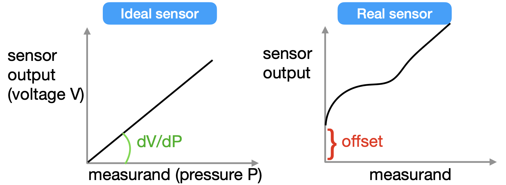

## 3. Devices

### 3.1 Sensors and Actuators

- **Sensors**: detect changes in the ambient condition or in the state of another device or a system, and forward this information. 
    - *Convert physical signals into electrical signals*

    In IoT systems, sensors are used for measuring certain quantities in an environments. The easurement will correspond to a certain action. For an ideal sensor, we expect to have a simple relationship between out input and out output.

    
    **Vendors provide specs that describe how the device behaves.**

    - Manufacturers usually tell the span or the operating range of their devices, like for what values of the measurand you. get a certain sensitivity.

    - **Mechanical sensors**: Sensors need time to collect data and to respond to the signal, we can model this dynamics with second order mechanical system. The bandwidth of a sensor, also referred to *"frequency response"*, is a measure of the ability of the sensor to perceive and respond to changes in the measurand.

- **Actuators**: are components of a device able to move the mechanism implemented in the device. Is the mechanism by which a **control system** acts upon an environment, responding to the conditions measured by a sensor. 
Motion can be:
    - *Linear*: the actuator generates movement along a straight line.
    - *Rotary*: the actuator generates a circular motion.