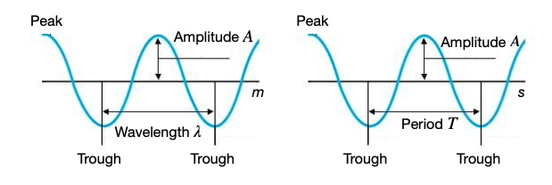

## 5. Communication

### 5.1 Radio Frequency Communication (PHY)

- In IoT, smart devices collect data and work together to accomplish a common objective.

- Smart things form the **perception layer** of an IoT architecture.

- These devices have very limited computation capacities and are scattered arround possibily large areas. For these reasons, they must be able to **communicate** thier data.

#### 5.1.1 Electromagnetism Theory

- **Photon**: The smallest amount of energy that can be transportend.

Energy that can be transported by a photon:
$$
E = hf
$$
Where $h$ is the Planck constant and $f$ is the **frequency** of the wave

**Can we use EM waves to comunicate?** Yes. We can encode information by sending an EM source and varying its properties. with **different wavelenghts**:

- Higher frequencies are more dangerous to humans.

- High and low frequencies tend to go through objects

- Lower and middle frequencies are easier to make and control with circuits.

**How to generate EM waves?** Need some qay to generate EM waves in a controllable way.

*Electricity in a wire produces an EM filed*.

To make electricity flow in a wire, you need to have two points with a voltage difference.

- **RF Circuits**: Circuits where the electricity flowing through them is *modulated* at radio frequencies

#### 5.1.2 Antenna Design
- The field has a certain orientation, it is *polarised* in a direction.

- In order to be able to receive the signal, the orientation of the receiver antenna must match that of the transmitter.

We can classify antennas also depending on the radiation patterns, **similarly to light sources**.

**Antenna metrics** - *GAIN*: the gain $G$ of an antenna is a measure of how well the antenna directs its radiated power in a specific direction compared to an **isotropic** (an ideal antenna that radiates the signal equally in all directions) antenna.

$$G = \eta \cdot D$$

- **$\eta$** is the antenna's radiation **efficiency**.
- **$D$** is the **directivity**, that is the ability of an antenna to focus radiation in one direction.

**Bandwidth** of an antenna is the range of frequencies over which the antenna can effectively transmit or receive signals.

| **OMNIDIRECTIONAL** | **DIRECTIONAL** |
|----------------------|----------------|
| Used to send EM signals to receivers whose location is not fixed. | Used to send EM signals to fixed receivers (satellite TVs, spacecraft). |
| Easier to install | Harder to install |
| Prone to interferences | Less interferences |
| Lower gain and directivity | Higher gain and directivity |

#### 5.1.3 Signal Propagation

The signal does not travel in a strainght line; Radio waves lose energy as they propagate (**Path Lose**) by going through air.
Radio waves get **deflected** or **reflected** when they hit objects; bounce off things and then recombine (**multipath** or **fading**).

**Free Space Propagation**: Energy emanated at the source expands out in a spherical way. A receiver o the sphere at distance $r$ receivs power:
$$
P_R = P_T \frac{A_e}{4 \pi r^2} = \frac{P_T}{L}
$$

Where: 
$$
L = \frac{4 \pi r^2}{A_e}
$$

**Path Loss Effects**: The way signals propagate very much depends on the environment; Signal transmitted by an antenna will travel around, be scattered, diffracted, reflected before reaching an IoT device.

#### 5.1.5 Multiple Input Multiple Output (<u>MIMO</u>)
Is a wireless technology that uses **multiple antessas** at both the transmitter and receiver to improve communication performance.
We can use:
- Spatial Diversity -> reduces fading by sending multiple, redundant versions of the signal through different paths in parallel

- Spatial multiplexing -> The transimitter **splits the data stream into multiple independent sub-streams** and sends them simultaneously through different antennas.

- Beamforming -> The transmitter directs signals toward specific devices instead of broadcasting the in all directions.

#### 5.1.6 Modulation

Modulation is the process of **encoding information onto an electromagnetic wave** (called the *carrier*) by varying one of its properties — amplitude, frequency, or phase — according to the transmitted data.

This allows digital or analog information to be sent over radio frequencies efficiently and reliably.

---

**Types of modulation**

| **Type** | **Full Name** | **What Changes** | **Description** |
|-----------|----------------|------------------|-----------------|
| **ASK** | Amplitude Shift Keying | Amplitude | Simple method where a "1" or "0" is represented by high or low signal amplitude. Easy to implement but very sensitive to noise. |
| **FSK** | Frequency Shift Keying | Frequency | Uses two distinct frequencies to represent binary states. More robust than ASK. Used in Bluetooth Classic, RFID, and LoRa. |
| **PSK** | Phase Shift Keying | Phase | Data is encoded by shifting the phase of the carrier wave. Very efficient and noise-resistant (used in Wi-Fi, ZigBee, 5G). |
| **QAM** | Quadrature Amplitude Modulation | Amplitude + Phase | Combines amplitude and phase changes to represent multiple bits per symbol (e.g., 16-QAM = 4 bits/symbol). High speed but needs a clean channel. |

---

**Symbol rate and bit rate**

- **Symbol rate (baud)** → how many times per second the signal changes state.
- **Bit rate (bps)** → how many bits are transmitted per second.

> Each symbol can represent multiple bits depending on the modulation type.  
> Example: in **16-QAM**, each symbol encodes 4 bits → `bit rate = 4 × symbol rate`.

---

**Constellation diagrams**

A constellation diagram represents all possible symbols in the I/Q plane:

- **I (In-phase)** → horizontal axis  
- **Q (Quadrature)** → vertical axis  
- Each point = one possible symbol

More points → higher data rate, but **less robustness** to noise and interference.

---

**Trade-offs**

| **Factor** | **Effect** |
|-------------|------------|
| Higher-order modulation (e.g. 64-QAM) | Increases data rate but requires higher SNR. |
| Lower-order modulation (e.g. BPSK) | Slower but more robust to interference. |
| Narrow bandwidth | Lower speed, longer range (e.g., LoRa). |
| Wide bandwidth | Higher throughput, shorter range (e.g., Wi-Fi). |

---

**Examples in IoT technologies**

| **Technology** | **Modulation Type** | **Characteristics** |
|----------------|--------------------|----------------------|
| **LoRa** | Chirp Spread Spectrum (variant of FSK) | Very long range, low data rate. |
| **Bluetooth** | GFSK (Gaussian FSK) | Medium range, low power. |
| **ZigBee / IEEE 802.15.4** | O-QPSK (Offset QPSK) | Reliable, moderate data rate. |
| **Wi-Fi** | BPSK, QPSK, 16–1024 QAM | Very high speed, short range. |

---

**In summary**

- Modulation transforms bits into radio signals.  
- More complex modulation = more bits per symbol → higher throughput.  
- However, it requires a **cleaner channel** (higher Signal-to-Noise Ratio).

> Understanding modulation is crucial to grasp how IoT devices transmit data wirelessly using standards like BLE, ZigBee, LoRa, and Wi-Fi.

### 5.2 Wireless MAC

#### 5.2.1 Multiple Access Techniques in Wireless Networks

When two or more hosts transmit over the same channel at the same time, the signals experience **collisions**.

1. Just let transimission collide - but data gets corrupted.
    
    - The corrupted packet propagates in the network and the computers detect the collision.
    - Most network devices have hardware able to distinguish collided traffic as it usually comes with higher voltage.

2. Collision Detection (CD) - you let your signal collide but detect when there is a collision and the sender retransmits.

3. Collision Avoidance (CA) - try to prevent collision.

*Carrier Sense Multiple Access* (**CSMA**) is used to manage how hosts share the same communication channel.

<u>CSMA/CD</u> in wired networks sets small packet sizes to make collision detection easier.

**Hiden Node Problem**: The problem is when a device might be visible to an access point (AP) but not to other nodes communicating with the AP.

**<u>TDMA</u>**: 
- Uses TIme Division Multiplexing. 
- Each user is allowed to transmit only within specific time intervals.
- When users transmit, they occupy the whole frequency band.
- Requires a **centralised coordinator** that allocates time slots to users within a **time frame**.
- The coordinator sponsors the time frame by broadcasting a **reference burst**, containing synchronisation information and time slot allocations.

**<u>FDMA</u>**:
-  The band is divided into sub-bands, each centred around the frequency that identifies the channel.
- No need for synchronisation among users.
- Low Latency, no waiting time slots.
- Avoid collisions.

**<u>Classical ALOHA</u>**:
- Works as a Time Division Multiple Access method without a coordinator.
- Each station can access medium at any time, following a **random access scheme**.

**Non-persistent CSMA**: if the channel is idle -> transmit immediately; if it's busy -> *wait a random time*, then listen again and retry. 

**p-persistant CSMA**: When the cannel is idfle, in each slot you transmit with probability $p$; with 1-p you defer to next slot.

**CSMA/CA**: If the channell is idle for a short interval -> pick a *random backoff*; count down only wshile the channel stays idle; when it hits 0, transmit.

**Demand Assigned multiple access (<u>DAMA</u>)** Two phases:

- *Contention phase*.

- *Transmission phase*.

**Multiple Access Collision Avoidance (MACA)**:
- Hidden node problem can solved by synchronisation with the coordinator, that usually is anAP or a base station.

- (slotted) *ALOHA* are very prone to collisions, but simple and versatile.

- **<u>MACA</u>** presents a simple scheme to avoid collisions and solve the hidden node problem.

**Code Division Multiple Access (CDMA)**:
- Is a multiple access technique in which all users use the same channel (same time and frequency), but their signals are distinguished by unique codes.

- Each user is assigned a binary code that is *orthogonal* to the others, meaning their cross-correlation is zero.

#### 5.2.2 Wireless Networks

**WiFi: IEEE 802.11 Wireless LANs**
**BSS**: Fundamental building block of the WiFi architecture. Contains multiple wireless devices supporting WiFi and an AP that are interconnected with a router through an Ethernet connection.

**Cellular Networks**: Are wireless networks consisting of both stationary and mobile nodes. Stationary nodes are base stations connected by wired links, forming a fixed infrastructure.

**MANETs**: is a *peer-to-peer* network that covers a renge of up to hundreds of meters. All nodes are mobile and there is no fixed infrastructure.

#### 5.2.3 Power Saving Algorithms
*Idea*: Shut down or idle parts of the system to save power.

- **Synchronise sleep/wake times**: Nodes agree on "active" time and "sleep" time. 

- **Tell other nodes when you're awake**: Tell other nodes that you are awake by "beacons".

- **MAC-power saving algorithms**: Power savings IoT algorithms are fundamental for IoT applications relying on WSNs and used by many IoT protocols, as ZigBee and Bluetooth.

- **Beacon Tracking (BT)**: *Synchronous* wakeup algorithm using frame structures, one node is elected to be the coordinator, it sends a time frame. The first entry is the beacon, the rest is used by the coordination to sposr a sleep and wake schedule that other nodes store and follow.

#### 5.2.4 MAC protocols for WSNs
**MAC** protocols for WSNs can be:
- Contention-based
- Contention-free

**Sensor MAC** (S-MAC): is an energy efficient protocol specifically designed for WSNs. Most communication occurs between nodes as *peers*, rather than to a single base station. Suitable for applications that are latency-tolerant. Periodic listen and sleep mechanism to establish a low-duty-cycle operation on each node.

*Physical CS*: sense the channel, if energy above a certain threshold, the channel is deemed busy, idle otherwise.

*Virtual CS*: uses RTS/CTS mechanism as Virtual Carrier sense mechanism.

**Traffic Adaptive Medium Access** (TRAMA): employs a *traffic adaptive distributed election scheme* to decide transmission schedules. Uses three protocols:

- Neighboor Protocol (NP).
- Schedule Exchange Protocol (SEP).
- Adaptive Election Algorithm (AEA).

Assumes a single, time-slotted channel for both data and signaling tranmissions.

### 5.3 Mesh Networking

*<u>Mesh Networking</u>* consists in managing connections between networking elements in a dynamic way to forward data.

#### 5.3.1 Adressing

- **Hardware Addresses**: Interface/node comes with built-in address/key from factory, no address assign protocol needed. Otherwise addresses might be too long, harder to route on addresses.

- **Geographic Addresses**: are assigned depending o nthe location of the devices. Define a coordinate system and assign addresses to nodes based on that using GPS system.

- **Hierarchical Adresses**: Impose a tree on top of our topology and then constrain addresses according to the tree. Select a node as the root of the tree. Assign a set of addresses to the root, which uses one address for itself and assigns the remaining ones to its children. *Zigbees's* distributed addressing scheme: 
    - Distributed addressing scheme with hierarchical paradigm which assigns each node a unique 16-bit address and makes the following assumptions:
        - tree that it's going to be created has a maximum depth : $L$.
        - maximum number of children per parent : $C$.
        - maximum number of forwarding nodes per parent : $R, (R \le C)$.

- **Stochastic Addressing**: node choose random number as their address, simple, but requires conflict resolution to ensure uniqueness. 

#### 5.3.2 Mesh Routing

*<u>Proactive Routing</u>* -> We should always have routes available to everyone, at all times.

*<u>Reactive Routing</u>* -> We should create routes only when we need them.

**Link State Routing**: Each node maintains a map of the topology of the network called "topology database". Node exchange information about their knowledge of the network. Each node looks at its local topology and floods a series of link-state advertisement.

**Distance Vector Routing**: Each router knos the links to its neighbours. Each router has provisional "shortest path" to every other router. Nodes exchange this distance vector information with their neighbouring routers.

**Mesh Routing**: Link state and distance vector are not optimised for battery and bandwidth:
- In wireless communication, you get local broadcast "for free". No need do unicast all the neighbours. In *Mesh Networking*, used in wireless environments, these factors need to be accounted for.

Six different Algorithms:
1. Optimised Link State Routing (**<u>OLSR</u>**):
    - *Proactive* routing protocol that operates as link state, but avoids unnecessary updates. Nodes send broadcast messages to reach all neighbours. 

    - **Selection Algorithm**: given a node H with 1-hop neighbours $N_1(H)$ and 2-hop neighbours $N_2(H)$, select within $N_1(H)$ the smallest possibile set of nodes that cover the entire set of nodes in $N_2(H)$

2. Dynamic Source Routing (**<u>DSR</u>**):
    - *Reactive protocol*: no proactive network discovery whe the network is initialised. 
    
    - Route to a destination is discovered and stored by the source node and **embedded in the data packet**.

    - **RREQ**:
        | UID | SRC | DST | RTE |
        |-----|-----|-----|-----|
        | Used to ensure each message is not transmitted more than once| Node sending the RREQ | Node the RREQ is destined to | source route learned by the RREQ

        - To improve effiency, we can implement *caching*, source will cache route for some period of time, in case it wants to send more packets to that same destination later.

3. Ad Hoc On-demand Distance Vector (**<u>AODV</u>**): 
    - *Reactive* routing algorithm with Route Request messages to discover a route. 

    - Nodes on active path maintain routing information.
    
4. Tree routing:
    - Each node knows subrange of addresses for each children and is resposible for that block of addresses.
    - A node getting a packet to send to some other nodes just needs to check if the address is in its children's subranges.

5. Geographic routing:
    - Uses geographic address: geographic position information to make *progress* to destination.

    - The source sends messages towards the geographic location of the destination.

    - Each node keeps track of geographic location of neighbours, so it knows which neighbour makes most progress to destination.

    - Can get stuck in dead ends.
  
6. Gossip Routing:
    - *Idea*: there is new rumor, people start gossiping about that. Initially they gossip a lot and the rumor spreads out very quickly, then people get bored about the rumor and mention it more rarely.

    1. Every nde waits random time after it receives data, picks random targets and sends data.

    2. Some nodes might receive the same data multiple times and can decide to send it out again.

    - If all failures are transient and reoccurring, message will eventually reach the destination.

    - Slow propagation.

    . Variant: **Rumor mongering**.
